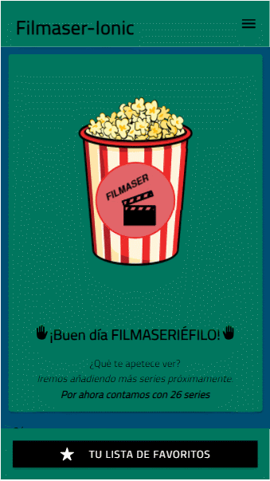
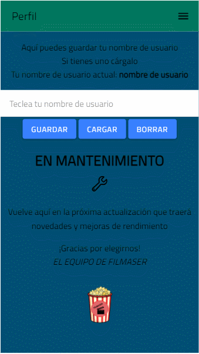
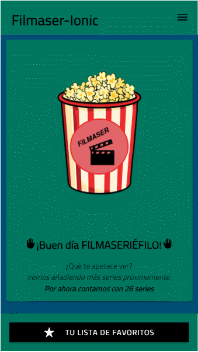

# Filmaser-Ionic

ACTUALIZACIÓN [4/03/2021] - VERSIÓN 2.5: Añadido el Local Storage en el Perfil e imágenes del README actualizadas.

Versión anterior: https://github.com/sergiotoscanodiaz/Filmaser-Ionic

Filmaser es una aplicación realizada en Ionic para la asignatura de Acceso a Datos correspondiente al segundo año del grado superior de Desarrollo de Aplicaciones Multiplataforma.

Esta aplicación consiste en una lista de series que puedes añadir a tu lista de favoritos.

--------------------------------------------------------------------

Cuando entras a la aplicación se ve esta pantalla.

# Login

Si pulsamos a Crear una cuenta, accedemos a esta pantalla.

# Registro

En el caso de que se nos olvide nuestra contraseña, podemos recuperarla facilitando nuestro correo electrónico.

# Recuperar contraseña

Sin necesidad de iniciar sesión, en el menú podemos acceder a la opción "Sobre la aplicación" que es una presentación de Filmaser.

# Sobre la aplicación

Al iniciar sesión, podemos acceder a más funcionalidades en el menú de la aplicación.

# Menú de la aplicación

Esta es la pantalla que se ve al entrar con tu cuenta.

# Presentación

Así se puede filtrar el género.

# Filtrar por géneros

Al pulsar sobre una serie aparece información de la misma y se puede añadir a tu lista de favoritos.

# Información de la serie

En la lista de favoritos, se verán las series que se han añadido.
Cada usuario tiene su propia lista con sus series favoritas.

# Lista de favoritos

Se pueden borrar series de la lista si es lo deseado.

# Borrar series

En el perfil podemos configurar un nombre de usuario. 
Esta parte está realizada con el almacenamiento local:

# Perfil

Podemos salir de la aplicación y volver a la pantalla de inicio de sesión.

# Salir de la cuenta

Por ahora, la aplicación cuenta con estas series.

# Listado de series

# Video explicativo

En este vídeo vemos las funcionalidades de la aplicación y un poco del código:
https://www.youtube.com/watch?v=fJmWwdBCVcI

Gracias por visitar este repositorio. ¡Deja una estrellita si te ha gustado :)!

