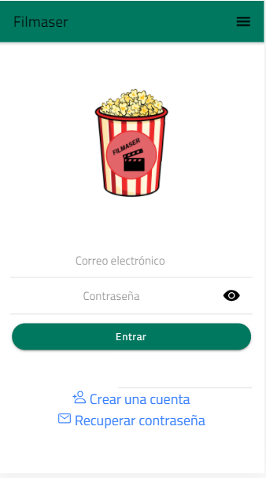
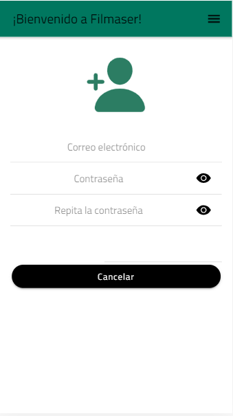
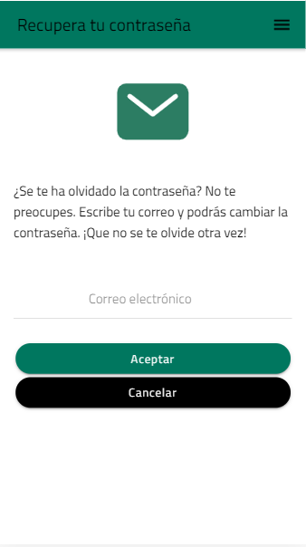

# Filmaser-Ionic

ACTUALIZACIÓN [16/02/2021] - VERSIÓN 2.0

Versión anterior: https://github.com/sergiotoscanodiaz/Filmaser-Ionic

Filmaser es una aplicación realizada en Ionic para la asignatura de Acceso a Datos correspondiente al segundo año de Desarrollo de Aplicaciones Multiplataforma.

Esta aplicación consiste en una lista de series que puedes añadir a una lista de favoritos.

NOTA: El diseño de la aplicación es provisional y faltan funcionalidades por implementar. Este es un primer vistazo.

Cuando entras a la aplicación se ve esta pantalla.

# Login

Si pulsamos a Crear una cuenta, accedemos a esta pantalla.

# Registro

En el caso de que hayamos olvidado nuestra contraseña, podemos recuperarla facilitando nuestro correo.

# Recuperar contraseña

Esta es la pantalla que se ve al entrar con tu cuenta

# Presentación

# Filtrar por géneros

Así se puede filtrar el género.

# Información de la serie

Al pulsar sobre una serie aparece información de la misma y se puede añadir a tu lista.

# Lista de favoritos

En la lista de favoritos, se verán las series que se han añadido y se pueden borrar si es lo deseado.
Cada usuario tendrá su propia lista.

# Salir de la cuenta

En el menú, por ahora, podemos salir de la aplicación.

# Listado de series

Por ahora, la aplicación cuenta con estas series.

Gracias por visitar este repositorio. ¡Deja una estrellita si te ha gustado :)!

